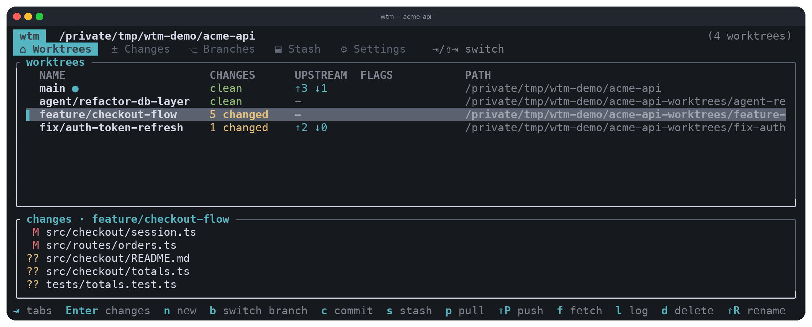
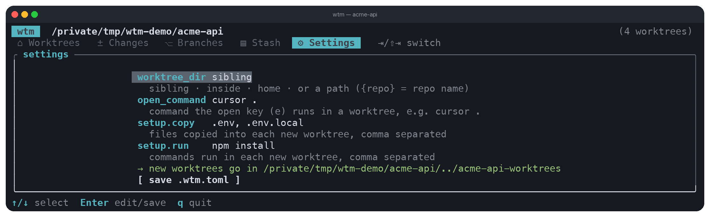
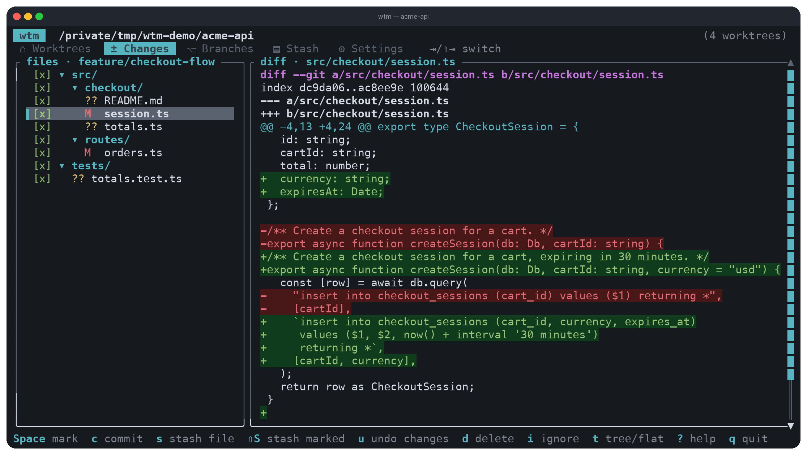
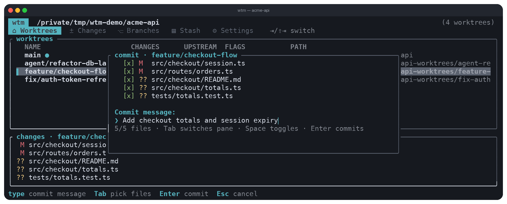
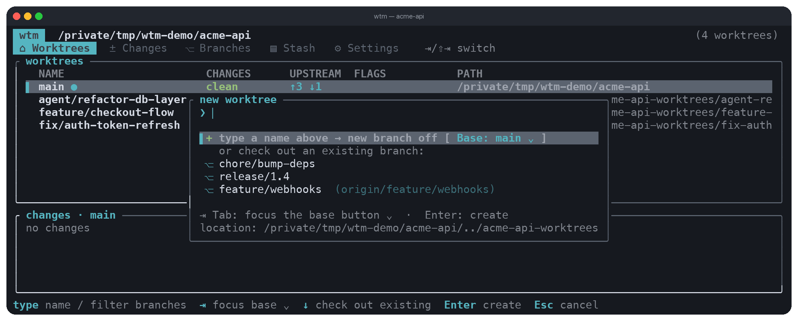
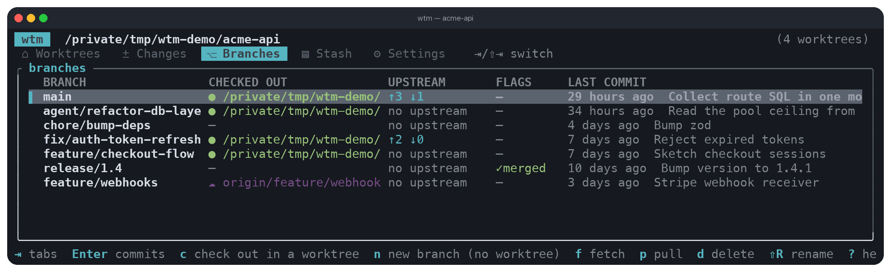
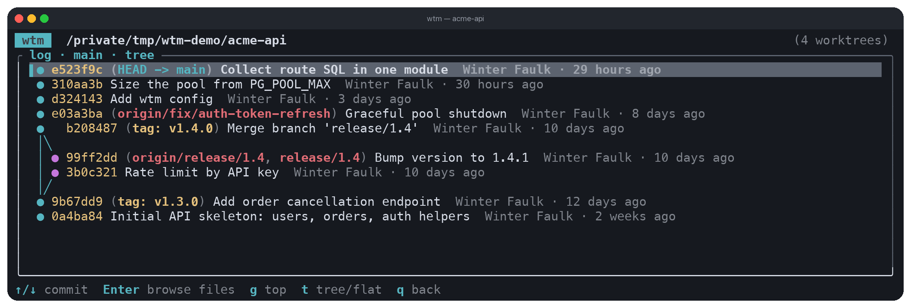
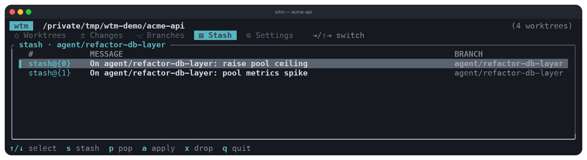
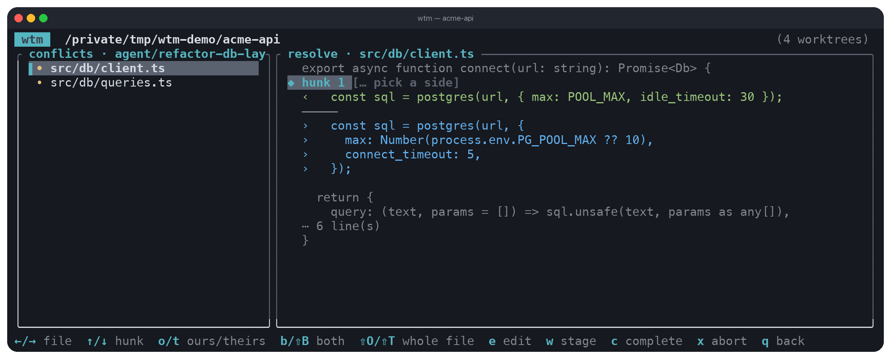

# wtm — worktree manager

A friendly top-level interface for git, built for working with AI agents on multiple branches at once. Create, list, inspect, and remove worktrees without knowing git commands, with automated per-repo setup (copying `.env` files, running `npm install`, and so on). Beyond worktrees it covers the everyday git workflow too: commit, stash, pull, push, fetch, branches, and log, all addressed by worktree name instead of paths and flags.

Three ways to use it:

- **TUI**: run `wtm` with no arguments inside a repo. It has five tabs (press `Tab`/`⇧Tab` to cycle): **Worktrees** (the worktree list with a live changed-files preview below it — `b` switches the selected worktree to another branch, `n` opens the new-worktree dialog, `⇧R` renames a worktree), **Changes** (browse and act on the selected worktree's diff), **Branches** (create, delete, rename (`⇧R`), and check out branches), **Stash** (stash/pop/apply/drop for the selected worktree), and **Settings** (edit this repo's `.wtm.toml` fields). Worktrees and Branches flag branches whose work has landed in the repo's default branch as `✓merged`. Press `?` for help, which opens on the page for whatever you're looking at; `Tab` moves between its pages and `↑/↓` scrolls. While typing in a field, `?` is a literal character, so use `F1` there instead.
- **CLI**: scriptable subcommands, all with `--json` output for agents
- **MCP**: `wtm mcp` serves worktree operations as MCP tools over stdio



The Worktrees tab is the home screen: every worktree with how many files it has changed, how far it is ahead of or behind its upstream, and any flags (`✓merged`, `locked`). The panel underneath lists the changed files of whichever worktree you have selected, so you can see what an agent has been up to without leaving the list. Every changed file is listed: when there are more than fit, `⇧↑`/`⇧↓` or the mouse wheel over the panel scroll it, and the border shows your position (`10-18/27`). Clicking a file there opens it on the Changes tab.

The mouse works throughout: clicking a tab switches to it, and clicking a row selects it.

## Setup

Requires `git` on your PATH.

Prebuilt binaries for macOS (Apple Silicon and Intel) and Linux (x86_64 and ARM64) are attached to every [release](https://github.com/faulker/wtm/releases):

```sh
tar -xzf wtm-vX.Y.Z-aarch64-apple-darwin.tar.gz
mv wtm ~/.local/bin/
```

To build from source instead you also need Rust (edition 2024 toolchain):

```sh
cargo build --release
# then put it on your PATH, e.g.:
cp target/release/wtm ~/.local/bin/
```

## Settings

Every repo must be initialized before worktree commands work: until a `.wtm.toml` exists in the repo root, `create`, `list`, and friends refuse with a pointer to `wtm init` (MCP tool calls report the same error). There are two ways to initialize:

- **`wtm init`**: a guided wizard in the terminal. It first offers to clone settings from another repo (give a path to the repo or its `.wtm.toml`), otherwise it asks where worktrees should go and what setup each new one needs, then writes `.wtm.toml`.
- **run `wtm` with no arguments**: in an uninitialized repo the TUI opens straight into a setup wizard. It opens on a welcome screen explaining what worktrees are for and what the one file it writes contains, then offers two routes: answer three questions, or copy the settings from a repo that already uses wtm (press `Tab` on the path prompt to pick the source with a file browser instead of typing).

  The three questions are where worktree folders should live (each choice shows the path it resolves to), which files to copy into them, and what to run once they exist. The last two arrive **pre-filled from your repo**: a `.env` sitting in the root is suggested for copying, and a lockfile (`pnpm-lock.yaml`, `package-lock.json`, `uv.lock`, `Gemfile.lock`, `go.mod`, and friends) suggests the matching install command. Every screen says why it's asking, `Esc` steps back exactly one screen keeping your answers, and both routes end on a review screen where you can still edit everything before the file is written.

```sh
wtm init
```



The Settings tab (`o` in the TUI) edits the same fields, with a hint under each one and a live preview of where new worktrees will land. `Enter` edits the selected row, and the `[ save settings ]` row writes the file, comments and all. Below the preview it shows the running version and whether an update is waiting, with a `[ check for updates now ]` row.

To view or change settings later, no TOML editing required:

```sh
wtm config                       # show every setting, its value, and where it came from
wtm config get worktree_dir
wtm config set worktree_dir inside
wtm config set open_command "cursor ."
wtm config set setup.copy ".env, .env.local"
wtm config set --global auto_update_check false   # stop checking for new releases
wtm config unset setup.copy      # back to the default (or the global value)
wtm config path                  # where the config files live
```

### Where worktrees go: `worktree_dir`

Pick a predefined rule or give a path yourself:

| Value | Worktrees end up in |
| --- | --- |
| `sibling` (default) | `../<repo>-worktrees`, next to the repo |
| `inside` | `.worktrees/` inside the repo (kept out of `git status` automatically) |
| `home` | `~/worktrees/<repo>` |
| any path | absolute, `~/...`, or relative to the repo root; `{repo}` expands to the repo folder name, e.g. `~/wt/{repo}` |

### Two config layers

Settings resolve per field: repo, then global, then built-in default.

- **Repo**: `.wtm.toml` in the repo root, applies to this repo only.
- **Global**: `~/.config/wtm/config.toml` (or `$XDG_CONFIG_HOME/wtm/config.toml`), applies to all your repos. Write to it with `wtm config set --global <key> <value>`.

`wtm config` shows which layer each value came from.

### The config file

`wtm init` and `wtm config set` maintain this for you (comments are preserved), but it's plain TOML if you'd rather edit by hand:

```toml
# "sibling", "inside", "home", or a path ({repo} = repo folder name)
worktree_dir = "sibling"
# Command the TUI's `e` key runs in a worktree's directory (e.g. open an editor).
open_command = "cursor ."
# Check GitHub for a newer wtm when the TUI starts. Usually set globally.
auto_update_check = true

[setup]
# Files copied from the main worktree into the new one (if they exist).
# Files in subfolders (e.g. "config/.env") land in the same subfolder.
copy = [".env", ".env.local"]
# Commands run inside the new worktree, in order. Stops at the first failure.
run = ["npm install"]
```

If a setup command fails, the worktree is kept so you can fix things by hand; `wtm create` reports the failure and exits with code 2.

Setup commands are interactive: with `wtm create` in a terminal they attach to your terminal directly, and in the TUI their output streams live into the progress window, where you can type a line and press `Enter` to answer a prompt. If a command hangs, press `Ctrl+C` twice in the TUI to kill it (the worktree itself is kept).

## CLI

```sh
wtm init [--force]                    # guided setup, writes .wtm.toml
wtm create <branch> [--from <base>]   # new worktree; creates the branch if needed, runs setup
wtm list                              # all worktrees with dirty count and ahead/behind
wtm remove <name> [--force] [--delete-branch]
wtm rename <name> <new-name>          # rename a worktree: renames its branch and moves the folder
wtm status <name>                     # changed files in a worktree
wtm diff <name>                       # unified diff of uncommitted changes
wtm path <name>                       # prints the path, e.g. cd $(wtm path feature-x)
wtm config [show|get|set|unset|path]  # view and change settings
wtm upgrade [--check]                 # update wtm itself to the latest release
wtm mcp                               # MCP server over stdio
```

Everyday git, addressed by worktree name:

```sh
wtm commit <name> -m <msg> [--paths a,b]   # stage (everything, or just --paths) and commit
wtm stash push <name> [-m <msg>]           # stash changes, untracked files included
wtm stash list|pop|apply|drop <name> [--index N]
wtm move-changes <from> <to>               # move uncommitted changes into another worktree (destination must be clean)
wtm pull <name> [--rebase]                 # fast-forward only unless --rebase
wtm push <name> [--force-with-lease]       # publishes with -u origin when no upstream yet
wtm switch <name> <branch> [--create]      # check a different branch out in the worktree; a remote-only
                                           # branch becomes a local branch tracking the remote.
                                           # --create makes a new branch off HEAD when it doesn't exist
wtm fetch                                  # fetch all remotes, prune deleted branches
wtm branch list                            # branches with checkout, tracking, last commit
wtm branch create <name> [--from <ref>]    # branch without a worktree
wtm branch delete <name> [--force]         # refuses if checked out in a worktree
wtm branch rename <old> <new>
wtm branch log <name> [-n <count>]         # a branch's commits without checking it out
wtm log <name> [-n <count>]                # recent commits (default 20)
wtm cherry-pick --into <name> <commit>...  # apply commits into a worktree (--no-commit to load only)
wtm merge <source> --into <name> [--no-ff] # merge a branch into a worktree's branch
wtm update <name>                          # refresh default from upstream, then merge into a worktree
```

Merging, updating, and resolving conflicts:

```sh
wtm merge <source> --into <name>           # merge; on conflict, leaves the tree mid-merge to resolve
wtm update <name> [--autostash]            # refresh default from upstream, then merge it in
                                           #   (fast-forwards in place when already on default;
                                           #   --autostash stashes local edits first, reapplies after)
wtm conflicts <name>                       # list conflicted files in the worktree
wtm conflicts <name> <file>                # inspect one file's conflict hunks (ours/theirs, --json)
wtm resolve <name> <file> --ours           # take our side of the whole file
wtm resolve <name> <file> --theirs         # take their side
wtm resolve <name> <file> --both           # keep both, ours then theirs on separate lines
wtm resolve <name> <file> --both-reversed  # keep both, theirs then ours
wtm merge --into <name> --continue [-m ..] # finish the resolved merge or cherry-pick
wtm merge --into <name> --abort            # abandon the merge or cherry-pick, restore the worktree
```

The same conflict flow covers four sources: `merge`, `update`, `cherry-pick`, and `stash pop` each report `conflicted` with the file list and leave the tree in place to resolve. `resolve` each file (or hand-edit it and `git add`), then finish: `merge --continue` completes a merge or cherry-pick (it auto-detects which), while a resolved stash pop finishes with `wtm stash drop <name>` (the conflicting pop keeps the stash). Every command takes `--json`, so an agent can drive the whole loop.

`wtm create` also pulls down remote branches: when the branch only exists on a remote, it creates a local tracking branch from it instead of branching off HEAD.

Everyday git operations, each scoped to one worktree addressed by name:

```sh
wtm commit <name> -m <msg> [--paths a,b]   # stage (all, or just these paths) and commit
wtm log <name> [-n <count>]                # recent commits (default 20)
wtm pull <name> [--rebase]                 # fast-forward pull, or rebase; errors if no upstream
wtm push <name> [--force-with-lease]       # push; publishes to origin with -u if no upstream
wtm stash push <name> [-m <msg>]           # stash changes, including untracked files
wtm stash list <name>                      # list stash entries
wtm stash pop|apply|drop <name> [--index N]
wtm move-changes <from> <to>               # move uncommitted changes from one worktree into another
```

Repo-wide commands (not tied to a single worktree):

```sh
wtm fetch                                  # fetch all remotes and prune deleted branches
wtm branch list                            # local branches: checkout, tracking, last commit
wtm branch create <name> [--from <ref>]    # create a branch without a worktree
wtm branch delete <name> [--force]         # delete; refuses if checked out in a worktree
wtm branch rename <old> <new>
wtm branch log <name> [-n <count>]         # a branch's commit history without checking it out
wtm cherry-pick --into <name> <commit>...  # cherry-pick commits into a worktree; --no-commit stages only
```

When `wtm create <branch>` is given a branch that only exists on a remote (e.g. `origin/<branch>`), it fetches if needed and checks out a local tracking branch from the remote instead of branching from HEAD.

Worktrees are addressed by branch name (or directory name when detached). Every command accepts `--json` for machine-readable output, so agents can simply run e.g. `wtm list --json`. Errors go to stderr as `{"error": "..."}` with a non-zero exit code.

## TUI

Run `wtm` inside a repo. If the repo isn't initialized yet, the setup wizard opens first (see [Settings](#settings)); once `.wtm.toml` exists you get the worktree list. Each worktree shows its change count, ahead/behind, and a **FLAGS** column: `✓merged` marks a worktree whose branch is fully merged into the default branch (safe to clean up), and `locked` marks a locked worktree.



`Enter` on a worktree opens the Changes tab. Files are grouped under their folders on the left (`[x]`/`[ ]`/`[~]` shows how much of a folder is marked), and the selected file's diff is syntax-highlighted on the right. From here you can mark files with `Space`, commit them with `c`, stash one or all of them, undo a file, or add it to `.gitignore`. `Enter` (or a double click) on a file opens it in whatever app your OS opens that file type with, and clicking the path in the diff panel's title copies it to the clipboard.



`c` commits without leaving the list. Tick the files you want (everything is selected by default, `Space` toggles), type a message, and `Enter` commits.



`n` creates a worktree. The top row makes a new branch off a base you pick with `Tab`; the rows below check out an existing branch, including remote-only ones like a teammate's `origin/feature/webhooks`, which become local tracking branches. Typing filters that list and names the new branch at the same time.



The Branches tab shows every branch, where each one is checked out, and which have already landed in the default branch (`✓merged`, safe to clean up). Remote-only branches are marked with `☁`. From here you can check a branch out in a new worktree, create or delete branches, merge one into a worktree, fast-forward onto upstream, or press `Enter` to browse and cherry-pick its commits.



`l` draws the log as a commit tree, with branch and tag names on the commits they point at, so forks and merges are visible at a glance. `Enter` browses into a commit to read the files it changed.



`s` opens the Stash tab: stash the selected worktree's current changes, then pop, apply, or drop any entry. Stashes are shared across the whole repo, so popping or applying one asks which worktree to put it into.

| Key | Action |
| --- | --- |
| `↑`/`↓` or `j`/`k` | select worktree (the mouse wheel over the table does the same) |
| `⇧↑`/`⇧↓` | scroll the changed-file panel below the table, which lists every changed file of the selected worktree. The wheel scrolls it too when the pointer is over it, and clicking a file opens it on the Changes tab |
| `Enter` | jump to the **Changes tab** for the selected worktree: the left panel groups changed files under their folders (a folder shows `[x]`/`[ ]`/`[~]` for all/none/some of its files marked); pick a file to see its **syntax-highlighted diff** on the right, with added/removed lines tinted green/red. Diffs load in the background, so switching files never freezes the UI. `←`/`→` (or `h`/`l`) **collapse/expand** the folder under the cursor (`←` on a file jumps to its parent folder). `Enter` toggles a folder row, and on a file row **opens the file** in the OS default application for its type; **double-clicking** a row does the same. `t` switches the file list between the folder tree and a flat path list. The **mouse wheel** scrolls whichever panel it's over — the file list moves the cursor, the diff panel scrolls the text — and clicking a row selects it. Clicking the **file path in the diff panel's title** copies that path to the clipboard. `Space` marks/unmarks the file, or the whole folder when the cursor is on a folder row; `s` stashes just the highlighted file, `⇧S` stashes every marked (`[x]`) file, `u` undoes (reverts) the highlighted file to its last committed state (a brand-new file has no committed version to revert to, so it says so and points you at delete instead), `d` deletes the highlighted file from the worktree, `c` commits the marked files, `i` adds the file or folder to `.gitignore` (choose the exact path or a glob that ignores everything like it), `?` shows help. New files inside brand-new folders are listed too, so you can view their contents. Updates live as files change; `r` refreshes now |
| `n` | new **worktree**. The top row creates a **new branch** (named as you type) branched off a base branch — press `Tab` to choose the base (defaults to the main branch). The rows below **check out an existing branch**: local branches plus **remote-only branches** (a teammate's work, shown with their `origin/…` ref) which check out into a local tracking branch. Typing **filters** that list while also naming the new branch, so you can search a long branch list. To make a branch *without* a worktree, use the branch browser (`b`) instead. If the target folder already exists you're asked to open it (when it's already a worktree), replace it, or cancel |
| `d` | delete the selected worktree: choose folder-only (keeps the branch) or folder + branch. If the worktree has uncommitted changes you're asked to stash them (keeping the work) or discard them. If the branch can't be safely deleted (not fully merged, or checked out in another worktree) you're offered a force delete; forcing a branch that's checked out elsewhere first switches that worktree to the repo's default branch |
| `c` | commit the selected worktree: tick which changed files to include (all selected by default; `Tab` switches between the file list and the message, `Space` toggles a file), type a message, `Enter` commits |
| `o` | **Settings tab**: edit this repo's settings (`worktree_dir`, `open_command`, `setup.copy`, `setup.run`) without touching the file. `↑`/`↓` pick a row, `Enter` edits it (`Esc` cancels that edit) and saves from the bottom row; leaving the tab discards unsaved edits |
| `e` | run the `open_command` in the selected worktree's directory (e.g. `cursor .`); prompts for a command when `open_command` isn't set |
| `u` | update the selected worktree: refresh the default branch from its upstream, then merge it in (or fast-forward in place when already on the default). If the worktree has uncommitted changes you're offered to stash them first and reapply them after the merge (so the update doesn't refuse on the dirty tree). On conflict, opens the conflict resolver |
| `s` | **Stash tab**: stashes are shared across the whole repo, not tied to one worktree. `s` stashes the selected worktree's current changes (with an optional message); `p`/`a` pick a destination worktree to pop/apply the selected entry into (defaulting to the worktree the tab was opened from), and `x` drops it. A pop that conflicts opens the conflict resolver |
| `m` | **move changes**: move the selected worktree's uncommitted changes into another worktree you pick (stash, then apply); refuses if the destination isn't clean |
| `p` | pull the selected worktree (fast-forward only). When the pull is refused because the branch has diverged from its upstream, offers to retry the pull with a rebase |
| `⇧P` | push the selected worktree; publishes with `-u` when there's no upstream |
| `f` | fetch all remotes and refresh |
| `b` | switch the selected worktree to another branch: a picker of branches not checked out anywhere, local ones first, then remote-only branches (marked with their remote, checked out as a local tracking branch when picked). Type to filter the list, `↑`/`↓` select, `Enter` switches, `Esc` clears the filter then closes. With nothing matching what you typed, `Enter` tries it as a branch name anyway |
| `Tab` / `⇧Tab` | cycle to the next/previous tab. On the **Branches tab**: every local branch, plus remote-only branches (marked `☁ origin/…`), with where each is checked out. `Enter` opens the branch's **commit history**, where `Space` marks commits (`a` all/none), `Enter` (or `v`/`→`) **browses into** the highlighted commit, and `p` **cherry-picks** the marked commits (or the highlighted one) into a worktree you pick — choosing to commit them directly (keeping the original messages) or just load the changes for review; `t` switches that history between the commit tree and a flat list. `c` checks the branch out in a new worktree, `n` creates a **branch only** (no worktree, from HEAD), `d` deletes (`⇧F` forces). `m` **merges** the selected branch into a worktree you pick. `f` **fetches** all remotes, refreshing every branch's ahead/behind; `p` **fast-forwards** the selected branch onto its upstream — a branch checked out in a worktree is pulled there so its files move with it, and one checked out nowhere is fast-forwarded in place without a checkout. Either way a branch that has diverged from its upstream is reported rather than merged |
| `l` | log of recent commits for the selected worktree, drawn as a **commit tree** showing where branches fork and merge, with branch and tag names marked on the commits they point at. `↑`/`↓` move a cursor between commits and `Enter` **browses into the highlighted commit** — a read-only view of the files it changed with each file's syntax-highlighted diff (`t` there toggles tree/flat, `←`/`→` collapse/expand folders, `⇧↑`/`⇧↓` or the mouse wheel scroll the diff). `t` switches the log between the tree and a flat list; the choice carries over to the Branches tab's commit history (where `Enter`, `v`, or `→` browses a commit the same way) |
| `r` | refresh (the worktree and branch lists also refresh themselves every minute, keeping your place) |
| `?` | help (works here and in the changes view; any key closes it) |
| `q` / `Ctrl+C` | quit |



When a merge, update, cherry-pick, or stash pop hits a conflict, the **conflict resolver** opens automatically. It lists the conflicted files (each with a resolved/unresolved marker) and shows the selected file's hunks as **OURS** (green — what's already in this worktree, the current branch) vs **THEIRS** (blue — what's being pulled in, labelled with where it comes from: the merge, cherry-pick, or stash). `←`/`→` move between files, `↑`/`↓` between hunks; `o`/`t` keep ours/theirs for the current hunk, `b`/`⇧B` keep both (ours-then-theirs or reversed, on separate lines), `⇧O`/`⇧T` take the whole file's side. `e` opens a small editor to **hand-edit the result** for the current hunk (seeded with both sides so nothing is lost); `Ctrl+S` saves that manual result, `Esc` discards it. `w` (or `Enter`) stages the resolved file (refuses until every hunk has a side), `c` completes the operation (commit the merge, continue the cherry-pick, or drop the popped stash), and `x` then `y` aborts and restores the worktree. `Esc`/`q` leaves it in progress so you can come back to it.

Every text field (the new-branch name, the commit message, stash and branch names, and the settings and setup-wizard inputs) supports cursor editing: `←`/`→` move, `Home`/`End` jump, and `Backspace`/`Delete` remove characters mid-string.

Pressing `o` opens an editor for the repo's `.wtm.toml`: pick a row with `↑`/`↓`, press `Enter` to edit it, and select the `[ save settings ]` row to write. It shows a live preview of where worktrees will land, preserves any comments in the file, and clearing a field unsets it so the default (or global value) applies again. The `auto_update_check` row is a toggle rather than a text field (`Enter` or `Space` cycles it through on, off, and the inherited default), and it is saved in the global config since it applies to wtm rather than to one repo.

While setup runs, its output streams into the progress window. Type a line and press `Enter` to answer a prompting command; press `Ctrl+C` twice to kill a stuck setup.

## Staying up to date

When the TUI starts it looks up the latest [release](https://github.com/faulker/wtm/releases) on a background thread. This never delays startup: the first frame draws immediately, and if the network is slow or unreachable the check simply fails silently. If a newer version exists you get a prompt with the version, a link to the release notes, and two choices, update and restart, or not now. Postponing keeps the version visible on the Settings tab and doesn't ask again until the next launch.

The check uses the public release URLs, not `api.github.com`. `/releases/latest` redirects to the newest tag, so one lookup gives both the version and (via the release workflow's asset naming) every download URL. That matters because the GitHub API rate-limits anonymous callers per IP, which any shared or office network exhausts quickly, and a start-up check that fails for everyone behind one NAT would be worse than no check at all. No token is needed or used.

Installing downloads the build for your platform, verifies it against the release's SHA-256 checksums, checks that the new binary runs and reports the expected version, and only then moves it over the old one. If wtm lives somewhere your user can't write (a `/usr/local` or Homebrew install owned by root) it says so up front instead of failing halfway through.

From the command line:

```sh
wtm upgrade --check    # report whether a newer release exists
wtm upgrade            # download, verify, and install it
```

To turn the automatic check off:

```sh
wtm config set --global auto_update_check false
```

Or set `WTM_NO_UPDATE_CHECK` in the environment, which skips the check without touching any config file (useful in CI or offline). Explicit `wtm upgrade` runs and the Settings tab's check-now row always check regardless. Updates need `curl`, `tar`, and `shasum` or `sha256sum` on your PATH.

## MCP server

`wtm mcp` speaks MCP over stdio and exposes the same operations as the CLI. Results use the same JSON shapes as the CLI's `--json` output.

| Area | Tools |
| --- | --- |
| Worktrees | `list_worktrees`, `create_worktree`, `remove_worktree`, `worktree_status`, `worktree_diff` |
| Commits | `commit_changes`, `worktree_log`, `cherry_pick` |
| Merge/conflicts | `merge`, `update`, `list_conflicts`, `read_conflict`, `resolve_file`, `complete_merge`, `abort_merge` |
| Stashes | `stash_push`, `stash_list`, `stash_pop`, `stash_apply`, `stash_drop`, `move_changes` |
| Remotes | `pull_worktree`, `push_worktree`, `fetch_remotes` |
| Branches | `list_branches`, `create_branch`, `delete_branch`, `rename_branch`, `branch_log` |

Register with [Claude Code](https://claude.com/claude-code) from inside your repo:

```sh
claude mcp add wtm -- wtm mcp
```

The server binds to the repo it was started in and reloads `.wtm.toml` on every call.

## Build and test

```sh
cargo build            # debug build
cargo test             # unit + integration tests (temp git repos, MCP stdio session)
cargo build --release  # optimized binary at target/release/wtm
```

## Project layout

```
src/git.rs      thin wrapper around the git binary (worktree/status/diff parsing)
src/config.rs   layered config: global file + repo .wtm.toml, location rules
src/settings.rs wtm config and wtm init commands
src/ops.rs      core operations shared by CLI, TUI, and MCP
src/conflict.rs conflict-marker parsing and hunk resolution (ours/theirs/both)
src/update.rs   GitHub release check and self-update
src/platform.rs opening files in the OS default app, system clipboard
src/cli.rs      clap definitions
src/output.rs   human vs JSON rendering
src/tui/        ratatui app (state, rendering, event loop)
src/mcp.rs      MCP stdio server (rmcp)
tests/          end-to-end tests against throwaway git repos
```

## Releasing

Pushing a `v*` tag (or running the Release workflow with a bump type) builds,
tests, and publishes all four binaries with a SHA-256 checksum file.

The macOS binaries are codesigned, and notarized, when the Apple secrets are
configured on the repository; without them the release still goes out, just
unsigned. See [docs/macos-signing.md](docs/macos-signing.md) for which
certificate to get and which secrets to set.
